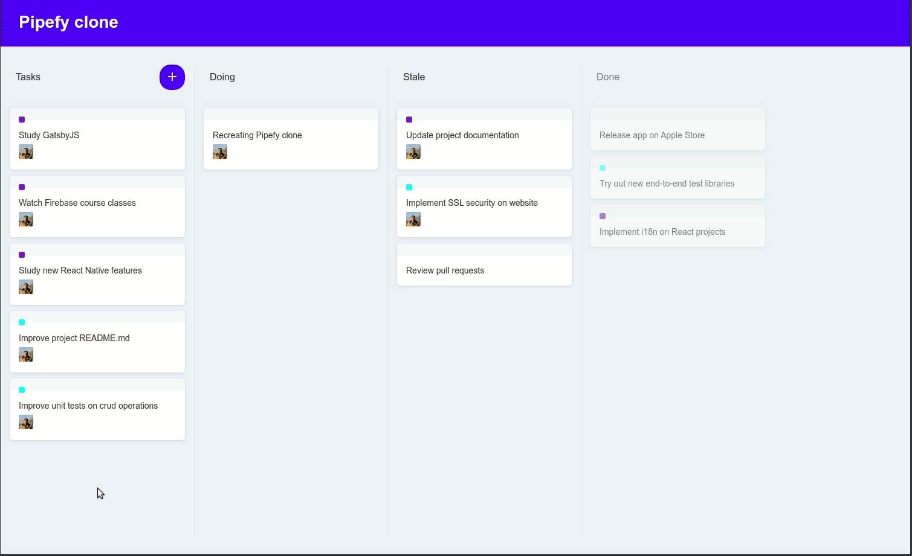

# Pipefy clone

This project is a simple side project implemented to put into practice concepts of the React Drag and Drop library - [React DnD](https://react-dnd.github.io/react-dnd/about). The output is a simple Kanban where the cards can be dragged and dropped onto another list or even over another card, overwriting the list original order.

<p align="center">
  
</p>

## Running

Simply install node dependencies and run the app

```
npm install && npm start
```
